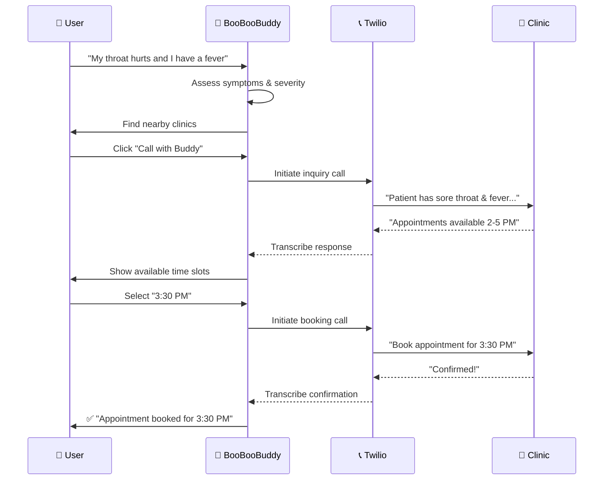

# BooBoo Buddy 🩹
## Demo! [Click here to try BooBoo Buddy live](https://boo-boo-buddy-p3hz.vercel.app/login)
Submission for Dialogue's challenge at Concordia's 2026 Hackathon. BooBooBuddy addresses the need for agentic healthcare beyond a chatbot; BooBooBuddy consider's the user's comprehensive health background and goals to suggest immediate care aligning with the user's preferences. BooBooBuddy utilizes past health data and the nature of the user's current conversation to determine the proper protocol: call immediate care for the user from a local healthcare clinic, or continue advising.

## How It Works



### 🧠 AI & LLM Integration

**OpenRouter API (GPT-4o-mini)**

- Powers the conversational interface with context-aware responses
- Progressively assesses symptom severity through natural dialogue
- Synthesizes raw conversation into clear medical summaries for clinic calls
- Analyzes call transcripts to extract availability, time slots, and booking confirmations

### 📍 Location & Clinic Discovery

**Google Places API**

- Finds nearby walk-in clinics and medical centers based on user location
- Retrieves clinic details: name, address, phone, ratings, hours
- Supports browser geolocation with localStorage caching

### 📞 Automated Calling

**Twilio Voice API**

- Makes real outbound calls to clinics on behalf of the user
- Uses text-to-speech to communicate patient symptoms and booking requests
- Records clinic responses and transcribes them automatically
- Supports two call types:
  - **Inquiry calls**: "Do you accept walk-ins or appointments?"
  - **Booking calls**: "I'd like to book for 3:30 PM"

### 💻 User Interface

| Component             | Description                                                                |
| --------------------- | -------------------------------------------------------------------------- |
| **Chat Interface**    | Conversational UI with message history and typing indicators               |
| **Voice Input**       | Microphone button using Web Speech API for hands-free input                |
| **Triage Indicator**  | Visual progress bar showing assessment stage (25% → 100%)                  |
| **Clinic Carousel**   | Horizontal scrollable cards with embedded Google Maps                      |
| **Call Status Modal** | Real-time feedback during calls (calling → waiting → analyzing → complete) |
| **Time Slot Grid**    | Clickable buttons for available appointment times                          |

### 🔄 Conversation States

```
GREETING → COLLECTING_SYMPTOMS → ASSESSING_SEVERITY → SEARCHING_CLINICS
    → PRESENTING_OPTIONS → CALLING_CLINIC → BOOKING_AVAILABLE
    → TIME_SLOT_SELECTION → BOOKING_CALL → BOOKING_COMPLETE
```

## High-level Architecture

```
┌──────────────────────────────────────────────────────────────────────────────┐
│                              🌐 FRONTEND                                      │
│                      Next.js 14 + React + TypeScript + Tailwind               │
├──────────────────────────────────────────────────────────────────────────────┤
│  💬 Chat Interface    │  🎤 Voice Input      │  🏥 Clinic Carousel            │
│  (Message history,    │  (Web Speech API,    │  (Google Maps embed,           │
│   typing indicators)  │   hands-free input)  │   call buttons)                │
├──────────────────────────────────────────────────────────────────────────────┤
│  📊 Triage Indicator  │  📞 Call Modal       │  🕐 Time Slot Grid             │
│  (Progress bar,       │  (Status updates,    │  (30-min intervals,            │
│   severity levels)    │   transcript display)│   one-click booking)           │
└──────────────────────────────────────────────────────────────────────────────┘
                                      │
                                      ▼ REST API (JSON)
┌──────────────────────────────────────────────────────────────────────────────┐
│                              ⚙️ BACKEND                                       │
│                         Next.js API Routes                                    │
├────────────────────┬─────────────────────┬───────────────────────────────────┤
│  /api/chat         │  /api/twilio/*      │  /api/test-places                 │
│  • LLM orchestration│  • call-clinic     │  • Clinic search                  │
│  • State management │  • get-transcript  │  • Location resolution            │
│  • Symptom synthesis│  • analyze-transcript                                  │
│                    │  • transcription-callback                               │
└────────────────────┴─────────────────────┴───────────────────────────────────┘
          │                    │                         │
          ▼                    ▼                         ▼
┌──────────────────┐  ┌──────────────────┐  ┌──────────────────────────────────┐
│  🤖 OpenRouter   │  │  📞 Twilio       │  │  🗺️ Google APIs                  │
│  (GPT-4o-mini)   │  │  Voice API       │  │  • Places API (clinic search)   │
│                  │  │                  │  │  • Maps Embed (clinic cards)    │
│  • Conversation  │  │  • Outbound calls│  │  • Geocoding (location lookup)  │
│  • Transcript    │  │  • Recording     │  │                                  │
│    analysis      │  │  • Transcription │  │                                  │
└──────────────────┘  └──────────────────┘  └──────────────────────────────────┘
          │
          ▼
┌──────────────────┐
│  🗄️ Prisma +     │
│  SQLite          │
│                  │
│  • User profiles │
│  • Health data   │
│  • Sessions      │
└──────────────────┘
```

### Tech Stack Summary

| Layer           | Technology                                         |
| --------------- | -------------------------------------------------- |
| **Frontend**    | Next.js 14, React 18, TypeScript, Tailwind CSS     |
| **Voice Input** | Web Speech API (browser-native)                    |
| **Backend**     | Next.js API Routes (Node.js)                       |
| **LLM**         | OpenRouter API → GPT-4o-mini                       |
| **Telephony**   | Twilio Voice API (calls, recording, transcription) |
| **Location**    | Google Places API, Maps Embed API, Geocoding API   |
| **Database**    | Prisma ORM + SQLite                                |
| **Auth**        | NextAuth.js (Google OAuth)                         |

## Getting Started

1. Clone the repository using the HTTP link.
2. Create a `.local.env` file in the root directory, and populate it with necessary API keys.
3. Install necessary dependencies by running `npm install`
4. Build using `npm build`
5. Run using `npm run dev`

## Contributors

Built during ConUHacks X at Concordia University, January 24-25th 2026.

- [@choiIsabelle](https://github.com/choiIsabelle)
- [@mchoi-cs](https://github.com/mchoi-cs)
- [@@B-Gilb022](https://github.com/B-Gilb022)

## License

MIT
