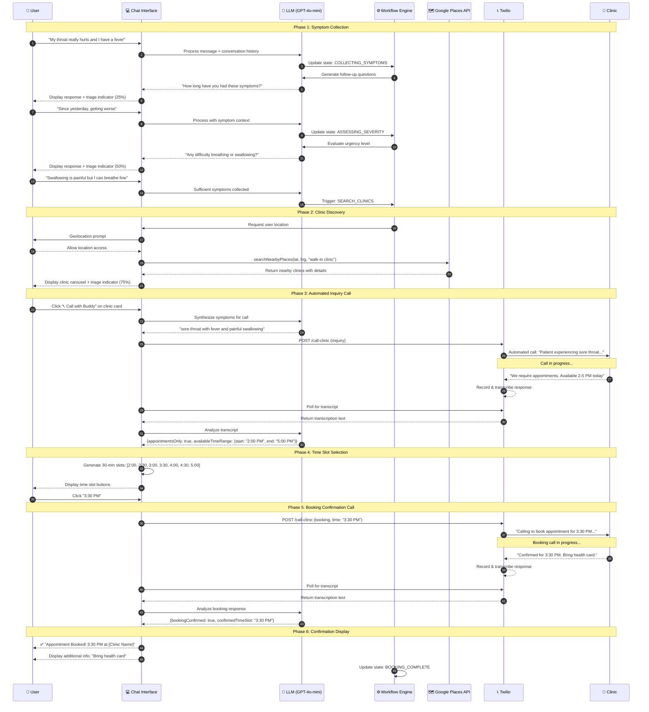
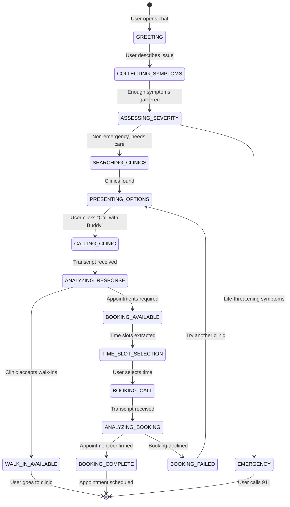
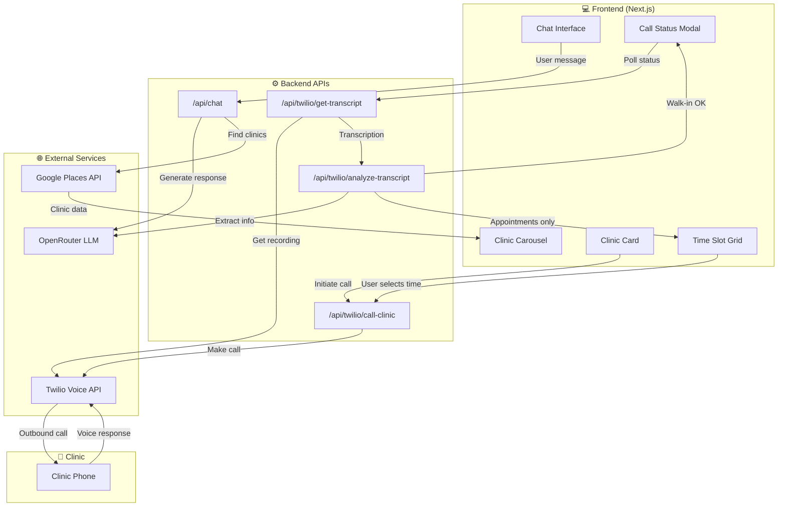

# BooBooBuddy Appointment Booking Flow

## Sequence Diagram



## State Transitions



## Component Interactions



## Data Flow Summary

| Phase | User Action | System Response | State Change |
|-------|------------|-----------------|--------------|
| 1 | Describes symptoms | Follow-up questions | COLLECTING → ASSESSING |
| 2 | Provides details | Clinic search triggered | ASSESSING → SEARCHING |
| 3 | Views clinic options | Carousel displayed | SEARCHING → PRESENTING |
| 4 | Clicks "Call with Buddy" | Twilio inquiry call | PRESENTING → CALLING |
| 5 | Waits for response | Transcript analysis | CALLING → ANALYZING |
| 6 | Sees available times | Time slots displayed | ANALYZING → SLOT_SELECTION |
| 7 | Selects "3:30 PM" | Booking call initiated | SLOT_SELECTION → BOOKING |
| 8 | Waits for confirmation | Booking confirmed | BOOKING → COMPLETE |

## Key API Payloads

### Inquiry Call Request
```json
{
  "clinicPhone": "+16135551234",
  "clinicName": "Wateridge Medical Clinic",
  "symptoms": "sore throat with fever and painful swallowing",
  "isBookingCall": false
}
```

### Transcript Analysis Response (Appointments Required)
```json
{
  "summary": "Clinic requires appointments, available between 2-5 PM today",
  "acceptsWalkIns": false,
  "appointmentsOnly": true,
  "availableTimeRange": {
    "start": "2:00 PM",
    "end": "5:00 PM",
    "date": "today"
  },
  "canBook": true
}
```

### Booking Call Request
```json
{
  "clinicPhone": "+16135551234",
  "clinicName": "Wateridge Medical Clinic",
  "symptoms": "sore throat with fever and painful swallowing",
  "isBookingCall": true,
  "requestedTime": "3:30 PM"
}
```

### Booking Confirmation Response
```json
{
  "summary": "Appointment confirmed for 3:30 PM, bring health card",
  "bookingConfirmed": true,
  "confirmedTimeSlot": "3:30 PM",
  "additionalInfo": "Please bring your health card and arrive 10 minutes early"
}
```
